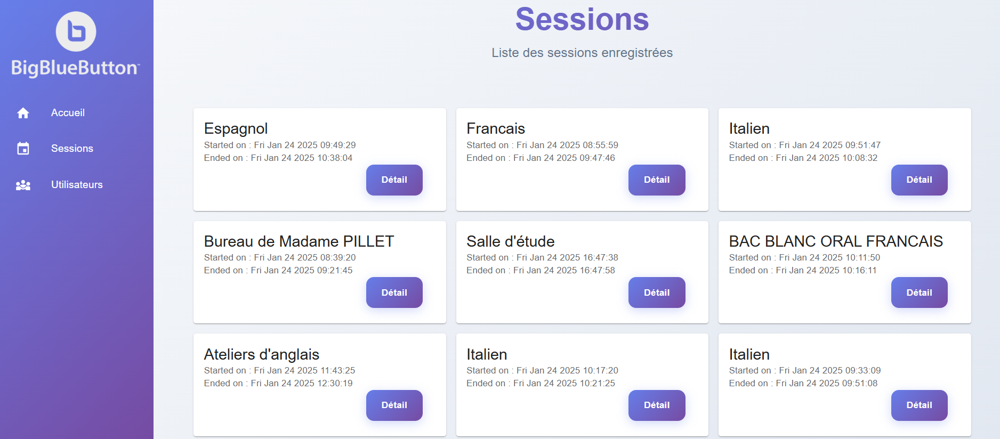
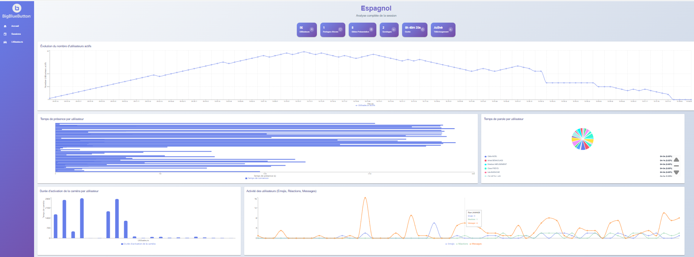
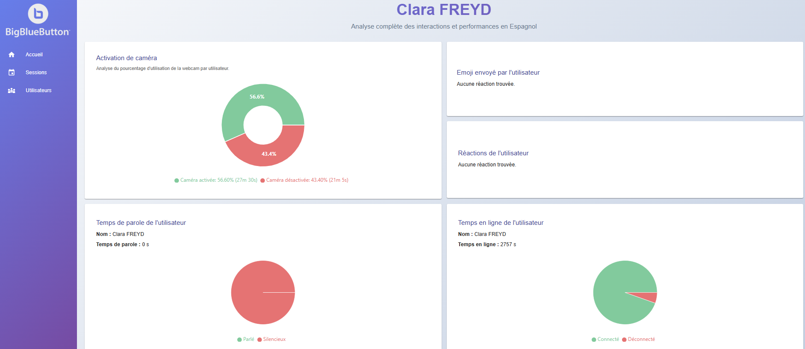
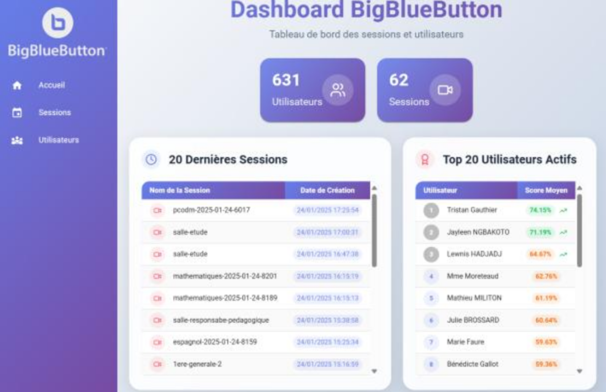
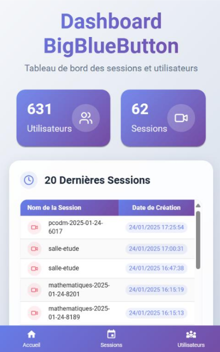
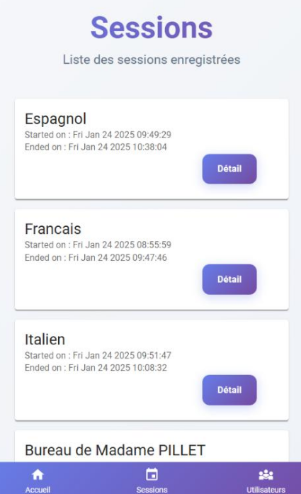

#  TPE BBB Analytics
BigBlueButton (BBB) est un outil de visioconférence utilisé pour l’enseignement à distance.  
Chaque session génère de nombreuses données (connexions, déconnexions, temps de parole, webcam, messages, réactions, etc.).

👉 Notre solution permet de transformer ces données brutes en indicateurs exploitables, visualisables dans un tableau de bord web interactif.

---
## 🎯 Objectifs
👉 L’objectif de ce projet est de développer un **système complet de Learning Analytics** permettant de :  
- **Stocker et organiser** les données issues de BBB.  
- **Calculer et analyser** des indicateurs par session et par participant.  
- **Visualiser** les résultats via un **dashboard interactif**.  
- **Exporter** des rapports (CSV, PDF).
---

## 🛠️ Technologies utilisées  

  
  
  
  
  
---

## Exemple de dashboard
**Des captures sur ordinateur**

**Des captures sur mobile**

  
  

